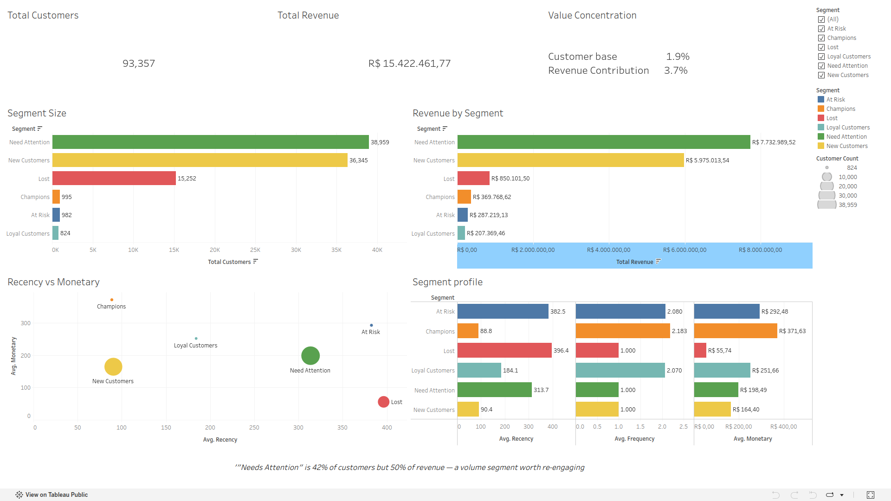

# Who Are Olist's Most Valuable Customers? — RFM Segmentation Analysis

An end-to-end customer segmentation analysis using Recency, Frequency, and Monetary (RFM) scoring on the Olist Brazilian E-Commerce dataset, to identify which customer segments actually drive revenue and how the business should prioritize retention efforts. Built with MySQL, Python, and Tableau.

**[View the interactive dashboard on Tableau Public →](https://public.tableau.com/shared/H6TBG7FHP)**


*(Add your dashboard screenshot to the repo and update this path)*

---

## Business Problem

Marketing wanted to run a retention campaign but had no way to distinguish customers worth prioritizing from ones who'd churn regardless — treating all customers the same risks wasting budget. This project segments customers using RFM (Recency, Frequency, Monetary) analysis to identify who's actually valuable, who's at risk, and where the business's revenue is really concentrated.

## Data & Tools

- **Dataset:** [Olist Brazilian E-Commerce Public Dataset](https://www.kaggle.com/datasets/olistbr/brazilian-ecommerce) — customer, order, and payment data for ~93,000 unique customers (delivered orders only)
- **SQL (MySQL):** Customer-level aggregation via CTEs and views, joining orders, customers, and payments
- **Python (pandas):** RFM scoring, segmentation logic, and business-value aggregation
- **Tableau:** Interactive segment-comparison dashboard

## Approach

1. Built a SQL view (`vw_customer_rfm`) aggregating order-level data up to one row per real customer (using `customer_unique_id`, since Olist assigns a new `customer_id` per order), calculating Recency (days since last delivered order), Frequency (count of delivered orders), and Monetary (total amount spent)
2. Scored each customer 1–5 on Recency and Monetary using quantiles
3. Adapted the Frequency scoring away from standard quantiles: since ~97% of customers in this dataset are one-time buyers, quantile-based scoring would have assigned arbitrary scores to statistically identical customers. Instead, used meaningful breakpoints based on actual order counts (1 order, 2 orders, 3–4 orders, 5+ orders)
4. Combined R/F/M scores into six business-relevant segments (Champions, Loyal Customers, New Customers, At Risk, Needs Attention, Lost)
5. Quantified each segment's share of customers vs. share of total revenue to identify where business value actually concentrates
6. Built an interactive Tableau dashboard comparing segment size, revenue contribution, and RFM profile

## Key Findings

- **Repeat buyers are rare in this marketplace:** ~97% of customers placed exactly one delivered order — a realistic characteristic of Olist's marketplace model, not a data quality issue
- **The largest revenue driver isn't the "best" RFM segment:** "Needs Attention" customers make up 41.7% of the customer base and generate **50.1% of total revenue** — more than any other segment, despite not scoring as top RFM performers
- **High-value segments are a small, real minority:** Champions and Loyal Customers together are just 1.9% of customers but contribute 3.7% of revenue — a modest but genuine over-representation
- **Lost customers show the lowest average spend** (R$55.74) and longest average recency (396 days), confirming the segmentation logic correctly separates disengaged customers from active ones

## Recommendation

Retention spend shouldn't focus solely on the small Champions/Loyal segment — with "Needs Attention" representing half of total revenue, even a modest re-engagement lift in that large volume segment (e.g., a targeted win-back campaign for customers who haven't ordered in 200+ days) would have outsized impact compared to a narrower campaign aimed only at already-loyal customers.

## Limitations & Next Steps

- RFM scores are based on historical behavior only; they describe past value, not predicted future value — a churn-prediction model would complement this analysis for forward-looking targeting
- Frequency scoring used manually chosen breakpoints rather than a statistically derived method, since the data's heavy skew toward one-time buyers made standard quantile binning meaningless — a reasonable adaptation, but worth stating explicitly rather than presenting as a standard textbook RFM implementation
- Next step: overlay product category or geography onto segments to see whether "Needs Attention" customers cluster around specific categories, which would make the recommended win-back campaign more targeted

## Repo Structure

```
├── sql/
│   └── vw_customer_rfm.sql                # View definition (recency, frequency, monetary per customer)
├── python/
│   └── rfm_segmentation.py                # RFM scoring, segmentation logic, business-value analysis
├── dashboard_screenshot.png
└── README.md
```
